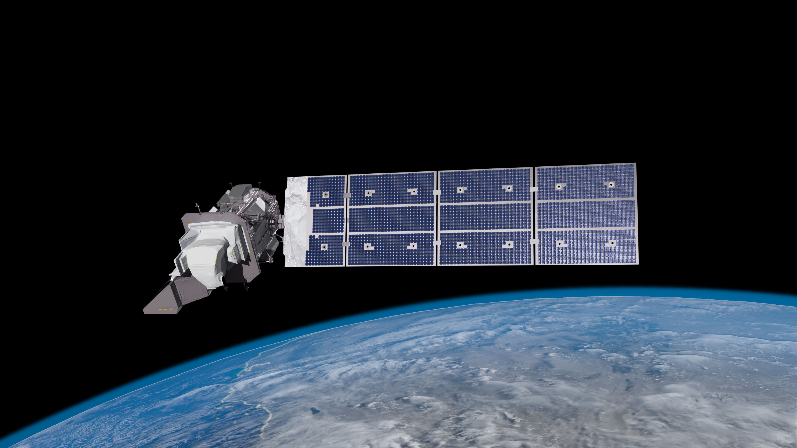
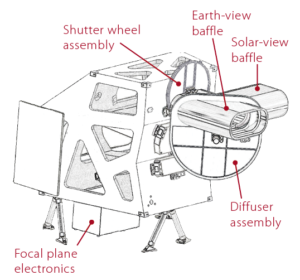
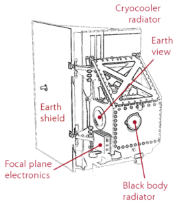
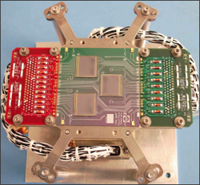
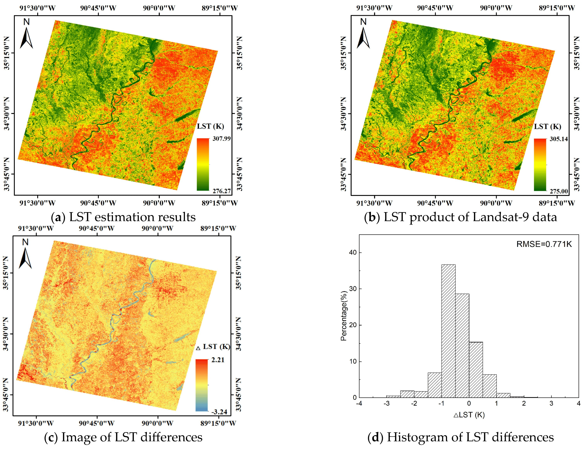
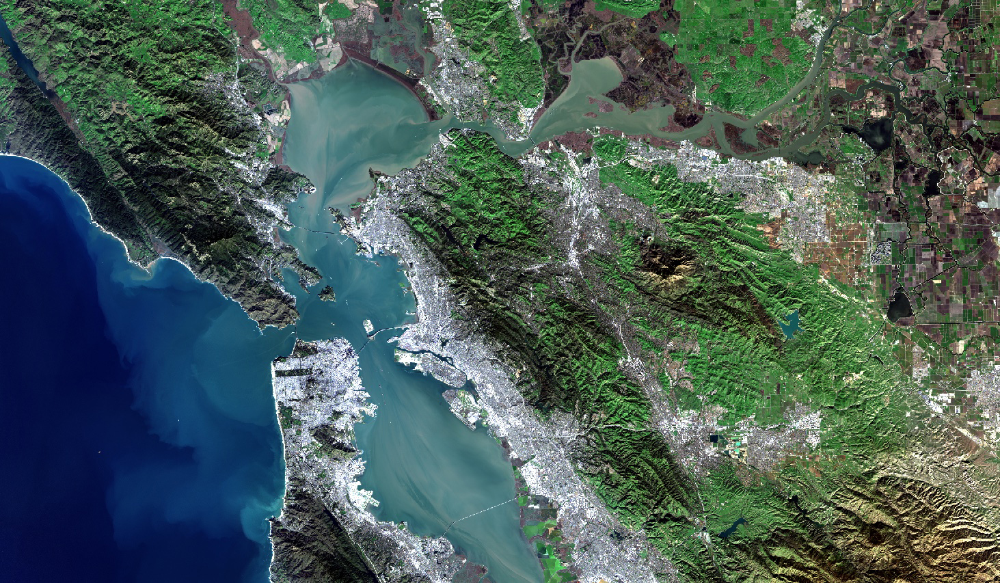

```{r setup, include=FALSE}
options(htmltools.dir.version = FALSE)

library(RefManageR)
BibOptions(check.entries = FALSE,
           bib.style = "authoryear",
           cite.style = "authoryear",
           style = "markdown",
           hyperlink = TRUE,
           dashed = FALSE,
           no.print.fields=c("doi", "url", "urldate", "issn"))
myBib <- ReadBib("./references.bib", check = FALSE)

library(knitcitations)
```

# Landsat 9

## The newest Landsat satellite

- Launched September 27th, 2021 by NASA
- The collected data is publicly available through USGS
- Replaces Landsat 7 (launched in 1999), taking its place in orbit
- Landsat 9 addresses the stray light issue seen in Landsat 8's TIRS.
- Together with Landsat 8 the revisit time for data collection is 8 days
- Captures imagery in 30 m spatial resolution

```{r, echo = FALSE, out.width='70%', fig.align='center'}
  
```

.link-style1[[NASA/Goddard Space Flight Center/Conceptual Image Lab](https://svs.gsfc.nasa.gov/vis/a010000/a013200/a013259/Landsat9_still_SW2.jpg)]

---
# The history of Landsat Satellites

```{r, echo = FALSE, out.width='98%', fig.align='center'}
  knitr::include_graphics('res/Landsat_timeline_20200318_title.gif')
```

`r Citet(myBib, "landsat9")` 

---
# Bands
Landsat 9, like Landsat 8, simultaneously images four visible spectral bands, one near-infrared spectral band, three shortwave-infrared spectral bands, one panchromatic band, and two thermal bands.

**New bands added to Landsat 9:**
- Coastal/Aerosol Band: Measures chlorophyll concentrations in coastal regions and aerosol detection
- Cirrus Band: Detects high, thin cirrus clouds.
- Two Thermal Infrared Bands

```{r, echo = FALSE, out.width='70%', fig.align='center'}
  knitr::include_graphics('res/all_Landsat_bands.png')
```
Image showing electromagnetic wavelengths captured by Landsat satellites. Source: NASA

---
# Technical Details
Landsat 9 carries two sensors: Operational Land Imager 2 (OLI-2) and the Thermal Infrared Sensor 2 (TIRS-2), which detect 11 wavelengths of visible, near infrared, shortwave infrared, and thermal infrared light. Both, with a five-year design life.

.pull-left[
###OLI-2

A diagram of OLI-2 showing its main components. Image credit: NASA
]

.pull-right[##TIRS-2

A diagram of TIRS-2 showing its main components. Image credit: NASA
]

---
class: left, middle
# Benefits of new sensors
The new types of sensors enable the satellite to

.pull-left[
- new sensors ensure dark regions like forests and coastal areas are better captured
- TIRS-2 uses thermal bands to detect subtle shifts in temperature—within a tenth of a degree Celsius.
- Detects thermal radiation in two thermal wavelengths and corrects atmospheric effects.
- Both TIRS-2 and OLI-2 have a 15-degree field-of-view covering a 185 km across-track swath
- much improved lifespan compared to its predecessor `r Citep(myBib, "lulla2021mission")` 
]

.pull-right[

.image-caption[
.center[TIRS-2 focal plane]
]
]
---
# Applications

The study by `r Citet(myBib, "jombo2023evaluating")` compared the data from Landsat 9 and 8, and Sentinel-2 imagery for urban land-use classification. They found that a model trained and evaluated with Landsat 9 data produced significantly better results than the other 2 sensors.

Another recent study used the data products of both Landsat 9 and 8 for monitoring water turbidity of wetlands in India `r Citep(myBib, "singh2024monitoring")`. The authors use the thermal infrared bands for estimating water surface temperature, enabling the monitoring of water quality pre- and post-monsoon event.

.pull-left[
By acquiring the TIR data at 100m resolution, `r Citet(myBib, "ye2023land")` develop an ensemble machine learning model for predicting land surface temperature (LST) from top of atmosphere bright temperature data. The developed algorithm is best able to predict LST in polar regions, due to changes in column water vapor.
]

.pull-right[
```{r, echo = FALSE, out.width='80%', fig.align='center'}
  
```
*Land surface temperature prediction from Landsat 9 TIR sensor data* `r Citep(myBib, "ye2023land")`
]

---
# Reflections

I believe the Landsat 9 satellite and the two sensors attached to it will be immensely useful for advancing global research. This satellite gave rise to a new generation of sensors to collect data for public good, since the captured data are made publicly available by USGS. I am very excited to learn about more about this satellites and what researchers will achieve with the data it collects. I hope the technological progress will enable new types of sensors with higher accuracy to become available to the public.

```{r, echo = FALSE, out.width='70%', fig.align='center'}
  
```

.center[Image of San Francisco from Landsat's 9 OLI-2 sensor
.link-style1[[Source: NASA](https://landsat.gsfc.nasa.gov/article/nasa-usgs-landsat-9-passes-review-now-operational/)]
]
---
class: left, middle
# References

.bibliography[
```{r, results='asis', echo=FALSE}
PrintBibliography(myBib)
```
]
