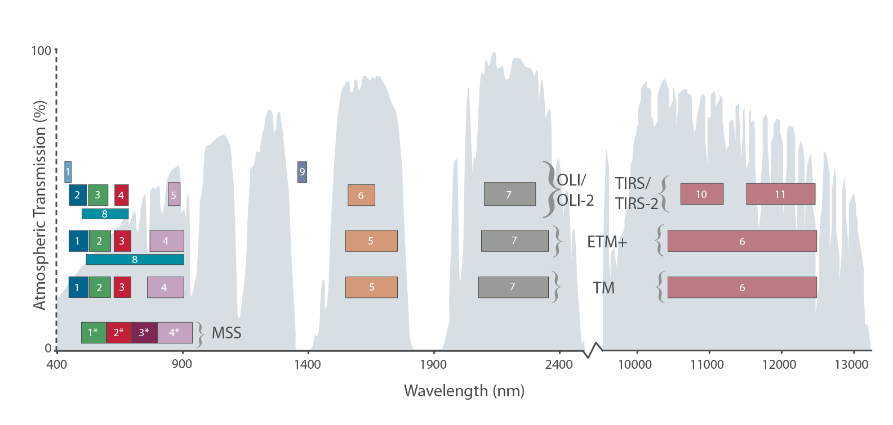

# Landsat 9
## The newest Landsat satellite
- Launched September 27th, 2021 by NASA
- The collected data is publicly available through USGS
- Replaces Landsat 7 (launched in 1999), taking its place in orbit
- Together with Landsat 8 the revisit time for data collection is 8 days
- Landsat 9 addresses the stray light issue seen in Landsat 8's TIRS.

---
# The history of Landsat Satellites

Figure adapted from [@landsat9].

---
# Technical Details
 Landsat 9 carries two sensors: Operational Land Imager 2 (OLI-2) and the Thermal Infrared Sensor 2 (TIRS-2), which detect 11 wavelengths of visible, near infrared, shortwave infrared, and thermal infrared light. Both, with a five-year design life.

.pull-left[
###OLI-2

A diagram of OLI-2 showing its main components. Image credit: NASA
]

.pull-right[##TIRS-2

A diagram of TIRS-2 showing its main components. Image credit: NASA
]

---
# OLI-2
Built by Ball Aerospace & Technologies Corporation.

- 30 m per pixel resolution
- Improvements to the sensor mean that dark regions like forests and coastal areas can be better captured.
- OLI-2 has a 15-degree field-of-view covering a 185 km (115 mi) across-track ground swath.

### New bands added to Landsat 9:
- Coastal/Aerosol Band (Band 1): Measures chlorophyll concentrations in coastal regions and aids in aerosol detection.
- Cirrus Band (Band 9): Detects high, thin cirrus clouds.
- Two Thermal Infrared Bands (Bands 10 & 11): Image data for two distinct thermal infrared spectral regions.
---

# TIRS-2
- 30 m per pixel resolution
- TIRS-2 uses thermal bands to detect subtle shifts in temperature—within a tenth of a degree Celsius.
- Detects thermal radiation in two thermal wavelengths and corrects atmospheric effects.
- TIRS-2 has a 15-degree field-of-view, matching the 185 km across-track swath of OLI-2.
]
---
# Bands
Landsat 9, like Landsat 8, simultaneously images four visible spectral bands, one near-infrared spectral band, three shortwave-infrared spectral bands, one panchromatic band, and two thermal bands. Two new bands were added to Landsat 9 to measure high, thin clouds and water quality.

Image showing electromagnetic wavelengths captured by Landsat satellites. Source: NASA

---
# References
